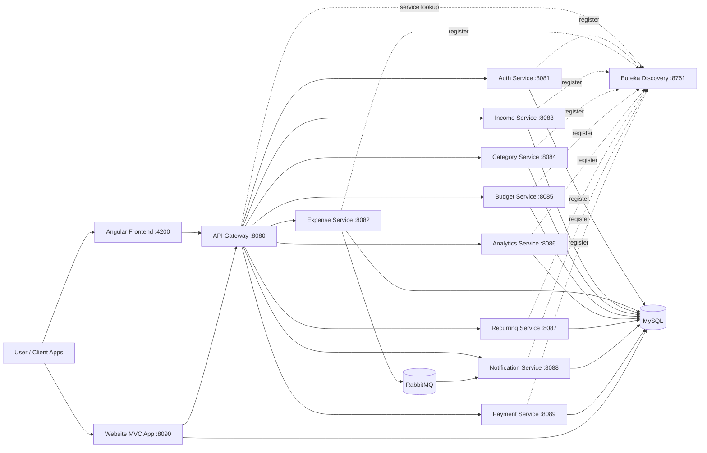
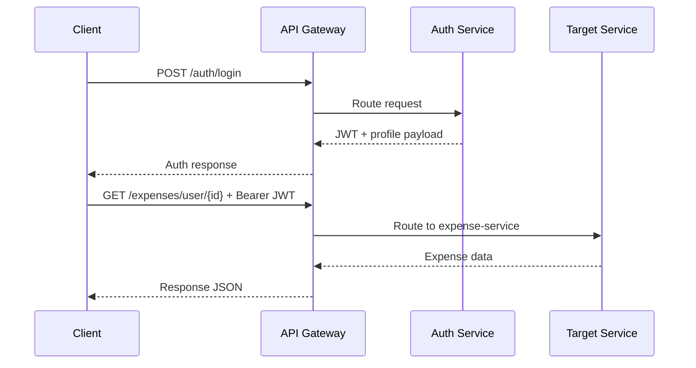
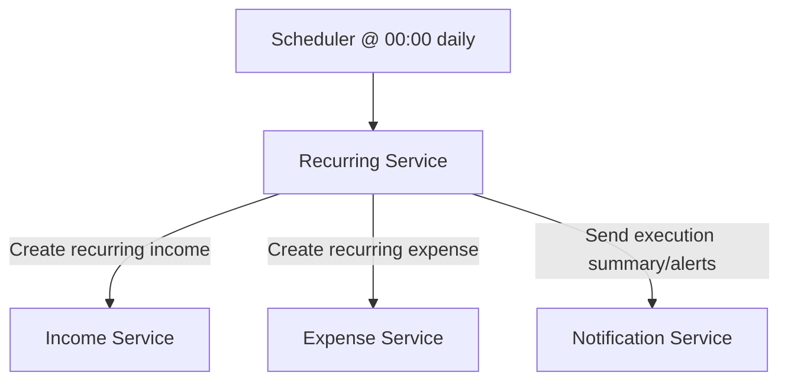
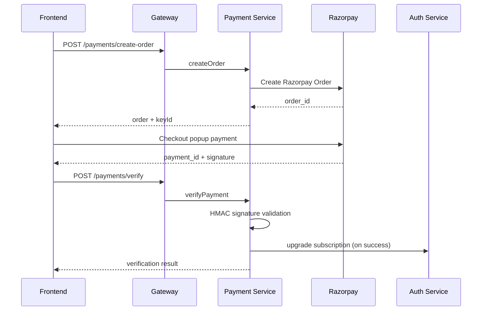

# SpendSmart Backend

> Draft v1 for review. Confirm and I will finalize/tighten this content exactly to your preferred style.

Enterprise-grade personal finance backend built with Spring Boot microservices, Spring Cloud Gateway, Eureka service discovery, JWT auth, asynchronous eventing (RabbitMQ), and payment integration.

## 1) At a Glance

- Architecture style: Modular microservices with API Gateway as single entry point
- Language/runtime: Java 21, Spring Boot 3.x
- Build system: Maven multi-module (parent POM)
- Data: MySQL (per-service schemas), JPA/Hibernate
- Discovery: Eureka Server
- Messaging: RabbitMQ (expense events -> notification workflows)
- API docs aggregation: Swagger/OpenAPI via Gateway

## 2) Architecture Overview



## 3) Core Service Catalog

| Module | Default Port | Base Route | Core Responsibility |
| --- | ---: | --- | --- |
| `discovery-server` | 8761 | n/a | Eureka registry for service registration/discovery |
| `api-gateway` | 8080 | `/` | Route aggregation, CORS, API doc aggregation |
| `auth-service` | 8081 | `/auth` | JWT auth, user profile, roles, subscription state |
| `expense-service` | 8082 | `/expenses` | Expense CRUD, filtering, totals, budget sync, event publish |
| `income-service` | 8083 | `/incomes` | Income CRUD, source/date filters, totals |
| `category-service` | 8084 | `/categories` | User categories, defaults, budget assignment |
| `budget-service` | 8085 | `/budgets` | Budget lifecycle, progress/adherence/alert calculations |
| `analytics-service` | 8086 | `/analytics` | Health score, forecasts, trends, monthly/yearly summaries |
| `recurring-transaction-service` | 8087 | `/recurring` | Scheduled recurring income/expense automation |
| `notification-service` | 8088 | `/notifications` | Inbox notifications, unread states, email for critical alerts |
| `payment-service` | 8089 | `/payments` | Razorpay order creation + payment signature verification |
| `website-mvc-app` | 8090 | `/app`, `/admin` | Server-rendered web/admin layer consuming backend APIs |

## 4) Gateway Routing Map

The API Gateway maps incoming paths to services:

- `/auth/**` -> auth-service
- `/expenses/**` -> expense-service
- `/incomes/**` -> income-service
- `/categories/**` -> category-service
- `/budgets/**` -> budget-service
- `/analytics/**` -> analytics-service
- `/recurring/**` -> recurring-transaction-service
- `/notifications/**` -> notification-service
- `/payments/**` -> payment-service

Global CORS is enabled in gateway and defaults to frontend origin `http://localhost:4200`.

## 5) Business Flows (Visual)

### 5.1 Auth + API Access Flow



### 5.2 Expense Event + Notification Flow

```mermaid
flowchart LR
    C[Client]
    GW[Gateway]
    EX[Expense Service]
    BU[Budget Service]
    MQ[(RabbitMQ)]
    NO[Notification Service]
    EM[SMTP Email]

    C -->|POST /expenses| GW --> EX
    EX -->|sync update spent amount| BU
    EX -->|publish ExpenseCreatedEvent| MQ
    MQ -->|@RabbitListener| NO
    NO -->|persist INFO/WARNING| NO
    NO -->|if CRITICAL then dispatch| EM
```

### 5.3 Recurring Automation Flow



### 5.4 Payment Verification Flow



## 6) API Surface Snapshot

Key endpoint families by service:

- Auth: register/login/google OAuth/password reset/profile/subscription/admin user management
- Expense: CRUD, date/type/search filters, monthly/daily/category totals, yearly totals
- Income: CRUD, source/date filters, recurring and month/year totals
- Category: defaults, user category setup, type-based retrieval, budget mapping
- Budget: active budget retrieval, progress, adherence, alerts, spent updates, reset flows
- Analytics: health score, forecast, trend lines, category breakdown, cashflow, snapshots
- Recurring: create/list/update/deactivate recurring plans + upcoming execution views
- Notifications: recipient inbox, unread count, mark read/all read, acknowledge, bulk/budget/email triggers
- Payments: create order, verify payment, user payment history

## 7) Folder Structure (Backend)

```text
SpendSmart-Backend/
|-- pom.xml                         # Parent Maven POM
|-- discovery-server/
|-- api-gateway/
|-- auth-service/
|-- expense-service/
|-- income-service/
|-- category-service/
|-- budget-service/
|-- analytics-service/
|-- recurring-transaction-service/
|-- notification-service/
|-- payment-service/
|-- website-mvc-app/
|-- logs/
`-- temporary/
```

Typical microservice layout pattern:

```text
<service>/
|-- pom.xml
`-- src/
    |-- main/
    |   |-- java/com/spendsmart/<domain>/
    |   |   |-- resource/          # REST controllers
    |   |   |-- service/           # Business logic
    |   |   |-- repository/        # Data access
    |   |   |-- entity/            # JPA entities
    |   |   |-- client/            # Feign clients
    |   |   |-- model/dto/         # DTO contracts
    |   |   `-- config/            # Security, MQ, app config
    |   `-- resources/
    |       `-- application.yml
    `-- test/
```

## 8) Startup Order and Local Run

Recommended startup order for local development:

1. `discovery-server` (8761)
2. `auth-service` (8081)
3. `api-gateway` (8080)
4. domain services (`expense`, `income`, `category`, `budget`, `analytics`, `recurring`, `notification`, `payment`)
5. optional: `website-mvc-app` (8090)

From backend root, build all modules:

```bash
mvn clean install
```

Run one service module:

```bash
cd <module-name>
mvn spring-boot:run
```

## 9) Configuration and Environment

Important env vars used across modules:

- `EUREKA_DEFAULT_ZONE` (default `http://localhost:8761/eureka/`)
- `FRONTEND_ORIGIN` (default `http://localhost:4200`)
- `DB_USERNAME`, `DB_PASSWORD` (service DB credentials)
- `*_SERVICE_PORT` variables for each service
- `RABBITMQ_HOST`, `RABBITMQ_PORT`, `RABBITMQ_USERNAME`, `RABBITMQ_PASSWORD`
- `SMTP_*` values for email dispatch (notification-service)
- `RAZORPAY_KEY_ID`, `RAZORPAY_KEY_SECRET` (payment-service)

Security guidance:

- Do not commit secrets.
- Use environment variables or secret managers.
- Keep JWT and payment credentials rotated and environment-specific.

## 10) Observability and Docs

- Eureka dashboard: `http://localhost:8761`
- Gateway Swagger UI: `http://localhost:8080/swagger-ui.html`
- Service logs: terminal output per module (or centralized via future stack)

## 11) Testing and Quality

- Unit/integration tests exist across modules under `src/test`.
- Parent POM config includes JaCoCo plugin for coverage reporting.
- Service-level H2 test configs are present in multiple modules.

## 12) Current Known Strengths

- Clear service separation and scalable module boundaries
- Strong API gateway strategy with consolidated CORS + docs routing
- Event-driven notification path for expense activity
- Scheduled recurring transaction automation
- Payment verification includes signature checks and subscription update integration

---

## Review Checkpoint

This is a complete draft intended for your review first. If you approve, I will finalize by:

1. Adjusting tone/length (concise vs enterprise-doc style)
2. Adding/removing API detail depth per service
3. Including optional deployment sections (Docker/K8s/CI) if you want